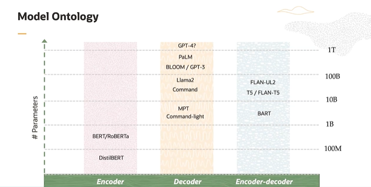
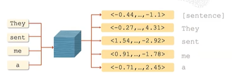
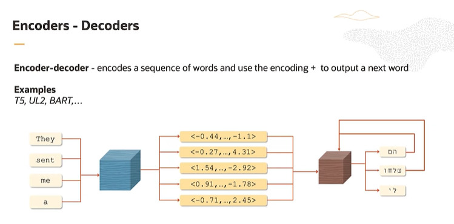
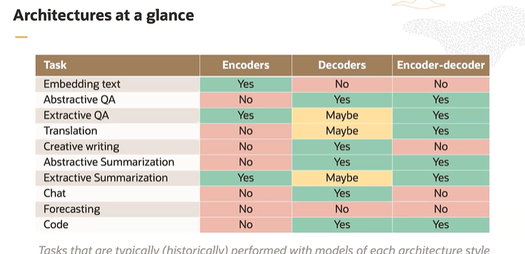
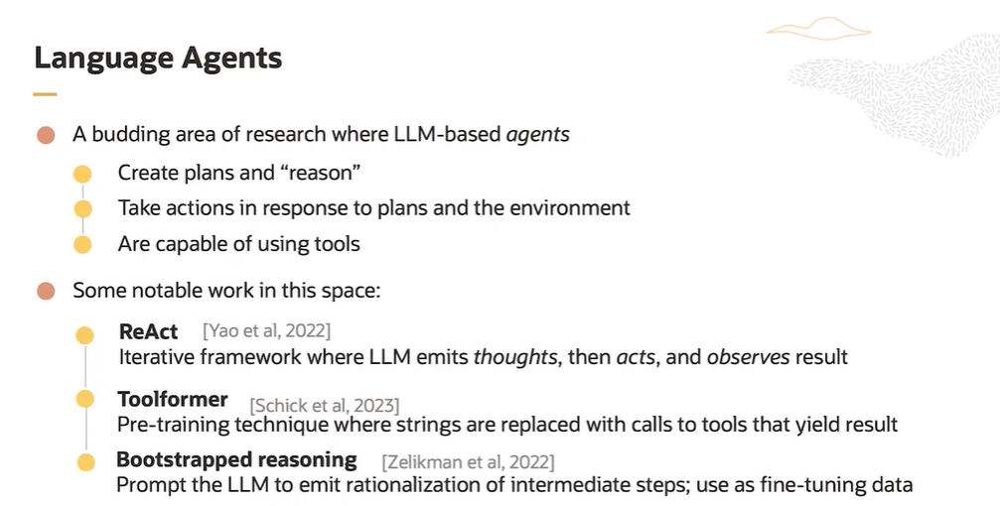

# Personal Study Notes - Oracle Gen AI Course

**Disclaimer:** These are my personal study notes for the Oracle Gen AI course and are not official course mat## Temperature

When decoding, temperature is a hyperparameter that controls the "randomness" of word selection.

- **Lower temperature** → distribution is sharper around the most likely words (more deterministic)
- **Higher temperature** → distribution is more spread out, making the model less predictable

**Important:** Temperature only matters when sampling is enabled. If using greedy or beam search without sampling, temperature has no effect.

With sampling enabled, increasing temperature makes the model deviate from greedy decoding.

Temperature does not change the relative ranking of words, only how sharply probabilities are applied. ## Beam Search

Beam search generates multiple candidate sequences in parallel, keeping only the top "beam width" sequences at each step. It then selects the most likely final sequence from them.

**Note:** Beam search can make text more repetitive and safe (less diverse). That's why modern LLM apps often combine top-p nucleus sampling + temperature instead of plain beam search. for educational purposes and personal reference only.

---

## LLM - Large Language Model

A language model is a very probabilistic model of text. Large in large language model (LLM) refers to the number of parameters; there is no agreed upon threshold.

## LLM Architectures

### Encoders and Decoders

Multiple architectures built on encoding and decoding focus on embedding and text generation.

Embedding is a way of representing words, tokens or entire pieces of text as numerical vectors so that the neural network can understand and process them.

### What an Embedding Represents

- Each token (word, subword, or character) is turned into a vector of, say, 768 or 1024 numbers
- The position of the vector in this space captures semantic relationships  
- Words with similar meaning end up closer together
- For example, the embeddings for "king" and "queen" are closer than for "king" and "banana"

All models are built on transformer architecture. Each type of model has different capabilities (embedding or generation). Encoders and decoders have different sizes.

In the realm of language models, size = number of trainable parameters that the model has. **Note:** Bigger isn't always better — scaling laws show performance grows with size, but only if matched with enough data + compute. Smaller models (e.g., DistilBERT) can still perform very well in narrow tasks.

Decoders are relatively large compared to encoders. When models are too small they have proven to be bad text generators. With a bit of added cleverness we may generate better text.

**Refer to the PDF to have more content on this topic.**

## Encoders

Models that convert a sequence of words to an embedding vector representation. These vector representations are designed to be consumed by later models to do things like classification or regression.

**Note:** In models like BERT, the final hidden states are used as embeddings, but for classification tasks there's often an added pooling or classification head. Encoders are not used for generative tasks (they're good at understanding, classification, search, retrieval).

A lot of their use these days is for semantic search or vector search in databases. Let's say we are wanting to retrieve a document from a corpus:

1. To accomplish this you could encode or synonymously embed each document in a corpus and store them in an index
2. When you get an input snippet you encode that too and check the similarity with the encoded input against the similarity of each document of the corpus and return the most similar one

## Decoders

Models take a sequence of words and output the next word.

**Examples:** GPT-4, Llama, Bloom, Cohere

What these models do is they take a sequence of tokens and emit the next token in the sequence based on the probability of the vocabulary which they compute. 

**Important:** During training, decoders are parallelized with teacher forcing (predicting all next tokens simultaneously). During inference, they generate sequentially one token at a time. They can produce embeddings, but that's not their strength.

We can always invoke a decoder over and over to generate many new tokens as we want. To do that we need to:

1. First feed in a sequence of tokens and invoke the model to produce the next token
2. Then append the generated token to the input sequence and feed it back to the model so that it can produce the second token

It is a very expensive process and typically we would not use a decoder model for embedding. Decoders are being used now for text generation as they have shown tremendous amounts of capability to do so.

## Encoder-Decoder

Encodes a specific sequence of words and uses the encoding to generate a whole output sequence conditioned on the encoder's representation. Used in translation, summarization, etc.

---

## LLM - Large Language Model

A language model is a very probabilistic model of text. Large in large language model (LLM) refers to the number of parameters; there is no agreed upon threshold.

## LLM Architectures

### Encoders and Decoders

Multiple architectures built on encoding and decoding focus on embedding and text generation.  
embedding is a way of representing words,tokens or entire pieces of text a numerical vectors so that the neural network can understand and process them
What an Embedding Represents
Each token (word, subword, or character) is turned into a vector of, say, 768 or 1024 numbers.
The position of the vector in this space captures semantic relationships.
Words with similar meaning end up closer together.
e.g., the embeddings for “king” and “queen” are closer than for “king” and “banana.”
All models are built on transformer architecture 
each type of model has different capabilities (embedding or generation)
 it encoders and decoders have different sizes
in the realm of language model size=no.of trainable parameters that model has 

decoders are relatively large compare to encoders 
when models are too small they have proven to be bad text generators  
with a bit of added cleverness we may generate better text 
Refer to the pdf to have more content on this topic 
encoders:

models that convert a sequence of words to an embedding vector representation
these vector representations are designed to be consumed by later models to do things like classification or regression 
But a lot of their use these days is for semantic search or vector search in databases 
lets say we are wanting to retrieve a document from a corpus 
to accomplish this you could encode or synonymously embed
each doc in a corpus and store them in an index
When you get an input snippet you encode that too and check the similarity with the encoded input against the similarity of each document of the corpus and return the most similar one 
Decoders :
Models take a sequence of words and output next word 
examples:GPT 4 ,Llama,bloom,cohere
What these models do is they take a sequence of tokens and emit the next token in the sequence based on the probability of the vocabulary which they compute 
a decoder produces only single token at a time 
we can always invoke a decoder over and over to generate many new tokens as we want
To do that we need to first feed in a sequence of tokens and invoke model to produce the next token then append the generated token to generate the input sequence and feed it back to the model so that it can produce the second token 
it is a very expensive process and typically we would not use decoder model for embedding
decoders are being used now for generation text as they have shown tremendous amounts of capability to do so 
encoder-decoder
encodes a specific sequence of words and use the encoding + to output a next word

## Chain of Thought Prompting

If we have a complicated set of tasks, prompt the LLM to emit immediate reasoning steps.

**Important:** CoT only works well when models have been trained with it (instruction-tuned with reasoning traces). Without that, they don't naturally "show their work."

**Least to Most Prompting:** Prompt the LLM to decompose the problem and solve easy first. Basically it was taught to do the easiest task first.

**Step Back:** Prompt the LLM to identify high level concepts pertinent to a specific task.

Prompting is very critical and unreliable sometimes because even a small space could make a great difference.

## Prompt Injection

### Issues with Prompting

Prompt injection is a process to provide the LLM with input that attempts to cause it to ignore instructions, cause harm, or behave differently, or behave contrarily to deployment expectations.

It can be used to extract some information which is not supposed to be exposed like private information.

**Important:** It's not just "providing malicious input" — it's indirect prompt injection too, where harmful instructions are hidden in retrieved or external data (e.g., in a webpage). This is one of the biggest security issues in RAG systems.

When deploying models this is one of the most important things to think about.

Prompt injection is a concern anytime an external entity is given the ability to contribute to the prompt.

## Domain Adaptation

Adapting a model to enhance its performance on data from a domain (subject area) that differs from the domain it was originally trained on.

**Methods:** Domain adaptation often involves fine-tuning (full or parameter-efficient like LoRA/PEFT) or retrieval-augmented approaches.

## Non-deterministic Decoding

Decoding is the process of generating text with an LLM.

- Decoding happens iteratively
- At each step, the model produces a probability distribution over the vocabulary and selects one word to emit
- The selected word is appended to the input, and the process continues
- **Greedy decoding** = deterministic, but very often low quality. Non-deterministic strategies like sampling or nucleus sampling (top-p) are more common in creative text generation

## Temperature

When decoding, temperature is a hyperparameter that controls the “randomness” of word selection.

Lower temperature → distribution is sharper around the most likely words (more deterministic).

Higher temperature → distribution is more spread out, making the model less predictable.

With sampling enabled, increasing temperature makes the model deviate from greedy decoding.

Temperature does not change the relative ranking of words, only how sharply probabilities are applied.

## Beam Search

Beam search generates multiple candidate sequences in parallel, keeping only the top “beam width” sequences at each step. It then selects the most likely final sequence from them.

## Hallucination

Hallucination refers to when a model generates content that is syntactically correct and fluent but factually incorrect, irrelevant, or entirely fabricated.

- Generated text that is non-factual
- LLMs are trying to generate text which matches human-generated text, whether or not it's true it needs to sound true
- LLM-generated text is sometimes not factual and can be difficult to spot
- No known method to eliminate hallucination
- Retrieval augmentation reduces but doesn't eliminate hallucinations
- Some methods like fact-checking with external knowledge or self-consistency also help

## Groundedness and Attributability

**Grounded:** Generated text is grounded in a document if the document supports the text.

**Attributability:** Usually refers to whether the model can cite/refer to the source from which an answer is derived, not just whether it's grounded.

## RAG (Retrieval-Augmented Generation)

Input is turned into a query which will be used to search a database. The returned answer will be returned to the LLM and the expectation is that the model will generate correct answers.

- It claims to reduce hallucinations
- Used in multi-document Q/A
- **Non-parametric:** RAG is non-parametric, meaning the model's weights don't need updating for new knowledge — you just update the retrieval corpus

## Code Models

Instead of training on written language, train on code and comments.

**Examples:** CodeLlama (Copilot isn't a model itself — it's powered by OpenAI Codex (earlier) and now GPT-4-turbo variants)

**Architecture:** Code models are typically decoder-only architectures.

**Capabilities:**
- Complete partly written functions
- Synthesize programs from docstrings
- Debugging

**Success Rate:** Largely successful - more than 85% of people using Copilot feel more productive.

## Multimodal

These models are trained on multiple modalities, e.g., images, text, audio.

These models can produce images or even videos from textual descriptions.

**Examples:** 
- **DALL-E** (image generator)
- **Multimodal LLMs:** GPT-4V, Gemini, and LLaVA (handle text+vision directly)

**Diffusion Models:**
- Can produce more complex output simultaneously rather than token by token
- Diffusion models are indeed common in vision but not in language because text is discrete
- Some attempts have been made; still not very popular

## Language Agents

A budding area of research where LLM-based agents are intended for sequential decision making, for example playing chess.

Language agents are a classical example of extension of machine learning agents.

**Modern Definition:** Today, "AI agents" usually means LLMs combined with tools, memory, and planning loops (like AutoGPT, LangChain agents), not just "sequential decision making." 

